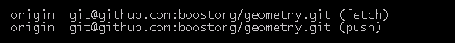

## Contributing to Boost.Geometry

### Prerequesites

* git (Git BASH on Windows)
* a compiler to run Boost tests - gcc, clang, Visual Studio Express, etc.
* configured GitHub account
* every step mentioned here: [TryModBoost](https://svn.boost.org/trac/boost/wiki/TryModBoost) understood and tested.
 
Other helpful links:

* http://git-scm.com/documentation
* https://help.github.com/articles/set-up-git
* https://help.github.com/articles/setting-your-email-in-git
* https://help.github.com/articles/generating-ssh-keys

### Testing the development branch of Boost.Geometry

Those are the steps which must be done to check out the Boost.Geometry repository and run tests
(also described here: https://svn.boost.org/trac/boost/wiki/TryModBoost#Developing):

Check out the develop branch:

    cd libs/geometry
    git checkout develop
    git branch -vv
    git pull

Run the tests:

    b2 test

If everything works for you, you may move forward.

### Create a fork of Boost.Geometry

1. Fork

2. Choose your profile
3. Wait
4. Done

### Check if the fork works

Go out of modular-boost/libs/geometry directory

    cd ../../..

clone (make a local copy) and change branch

    git clone git@github.com:username/geometry geometry
    git checkout develop
    git branch -vv
    git pull

see commits

    git log
    gitk

For now you should see exactly the same commits as in Boost.Geometry repository.

### Setup modular-boost to work with your fork

Go back to the Geometry module directory: modular-boost/libs/geometry

    cd ../modular-boost/libs/geometry

#### Add new remote repository

For now there is only one remote repository set for this local copy. You may check it running

    git remote -v

You should see something like this:

There is one remote repository added, the original Boost.Geometry repository at boostorg/geometry.git

Add another remote repository, your fork. Give it some memorable name.

    git remote add my_fork git@github.com:username/geometry

Now, after running

    git remote -v

you should also see the remote you just added

#### Create new branch for your work

Make sure you're in develop branch running

    git branch -vv

You should see

Now pick a name for your new branch. Try to choose the name which doesn't already exist. To check the names of existing remote branches run

    git branch -a

or check them directly on GitHub.

Lets say that you'd like to add some new feature. To reflect that, and because Boost is using the GitFlow branching model, you could name your branch `feature/example`. But choosing the name for a branch is really up to you since it won't be created in the original Boost.Geometry repository.

Create new local branch:

    git branch feature/example
    git checkout feature/example

Push it to your fork. This should create a remote branch for you

    git push -u my_fork feature/example

The `-u` switch also sets up the tracking of the remote branch.

Now after running

    git branch -vv

you should see

You should also be able to see it on GitHub

or while running

    gitk

 

### Modify the branch

At this point it's up to you what to do with your new branch.

A word about commits though. Run

    git log

or

    gitk

see what the commit messages convention is used.

In Boost.Geometry the commit messages should contain:

1. some name of the modified part of the library in the square brackets, e.g. an algorithm name (tip: look at the namespaces and directories),
2. a short title,
3. an extended comment in the new lines (tip: to add more lines to the commit message use git commit without the `-m` switch).

As it's mentioned in the GIT documentation (http://git-scm.com/book/en/Distributed-Git-Contributing-to-a-Project):

> It's also a good idea to use the imperative present tense in these messages. In other words, use commands. Instead of "I added tests for" or "Adding tests for," use "Add tests for."

At the end, push your changes to the remote branch

    git push my_fork feature/example

or if your local branch is tracking the remote one, just

    git push

### Request a pull

After pushing your work you should be able to see it on GitHub.

Click compare and pull request button

By default GitHub wants to request a pull to the boostorg/geometry:master branch

Change it by clicking the "Edit" button on the right side and pick develop branch

add some nice title and description

and click the "Send pull request" button.

### Done!

After the review your contribution will be merged into Boost.Geometry or you'll see some comments about issues that should be fixed before merging.
